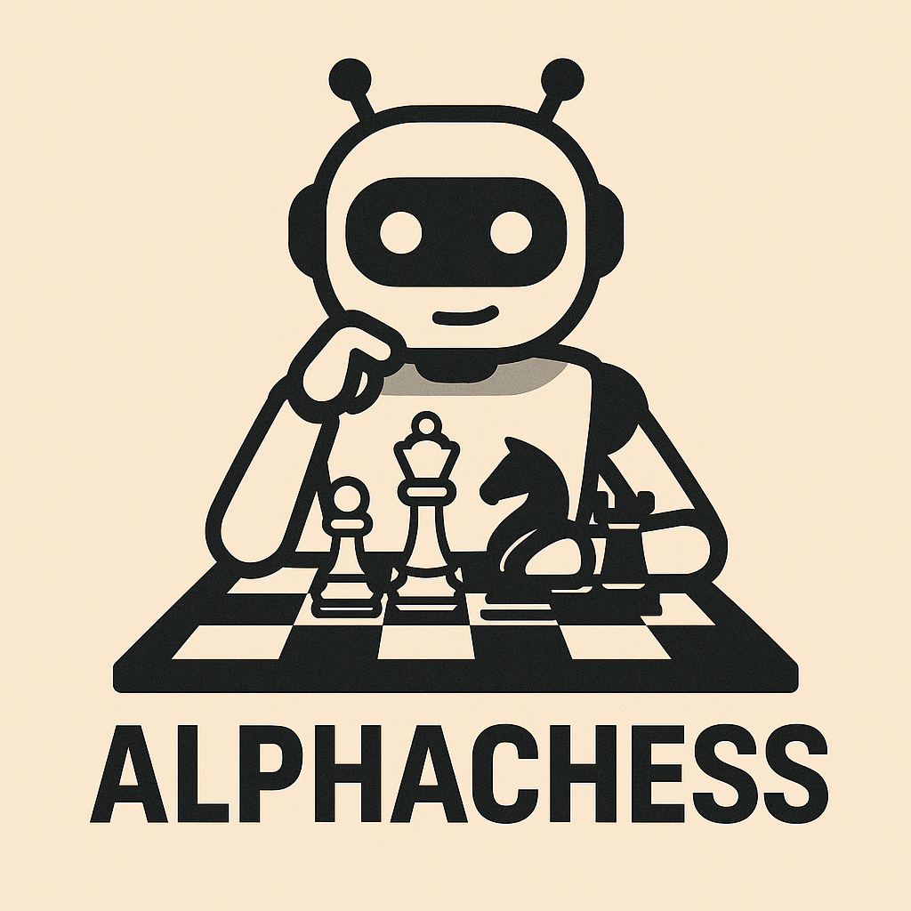

# ♟️ CoTChess ♟️

  

  
  
    
  
  
  

### Bridging the "Knowing-Doing Gap" in LLM Chess Agents with Reinforcement Learning

**CoTChess** investigates a common challenge: Large Language Models (LLMs) understand complex game rules, like in chess, yet often fail to apply this knowledge effectively in actual play. This is known as the "Knowing-Doing Gap" (KD Gap) [[1](https://arxiv.org/abs/2504.16078), [2](https://arxiv.org/abs/2504.20073)]. 

Our project explores how **Reinforcement Learning (GRPO)** can empower LLMs to play chess with greater reliability and strategic depth. We delve into behavioral patterns and neural representations to understand and bridge this gap.

---
## ✨ Team AlphaChess

*   **[Cheol Hun Yeom]** - Team Leader ([drhunny1@gmail.com](mailto:drhunny1@gmail.com))
*   **[In Soo Kim]**
*   **[Ye Rin Hong]**
*   **[Sung Woo Cho]**
*   **[Min Ho Kim]**

---
## 🎯 Research Objectives and Key Questions

**Objective:** Understand the Knowing-Doing Gap (KD Gap) in LLMs playing chess and evaluate how chain-of-thought (CoT) prompting and reinforcement learning fine-tuning (RLFT) influence the reduction of the gap.

**Key Questions:**

*   How does the KD Gap manifest in chess's strategic, sparse-reward setting?
*   What factors underlie the KD Gap, and how do CoT prompting and RLFT address them?
---
## ✨ Key Features

*   **Custom GRPO Trainer**: Implements a `CustomChessGRPOTrainer` inheriting from `trl.GRPOTrainer` tailored for chess puzzle trajectories.
*   **Chess-Specific Reward Model**: A `ChessReward` class to calculate rewards based on move correctness, format validity, and UCI compliance.
*   **Trajectory-Based Learning**: Executes and learns from multi-step chess puzzle trajectories.

---
## 📚 References

1.  Schmied, T., Bornschein, J., Grau-Moya, M., Wulfmeier, R., & Pascanu, R. (2025). *LLMs are Greedy Agents: Effects of RL Fine-tuning on Decision-Making Abilities*. arXiv preprint arXiv:2504.16078. URL: [https://arxiv.org/abs/2504.16078](https://arxiv.org/abs/2504.16078)
---
